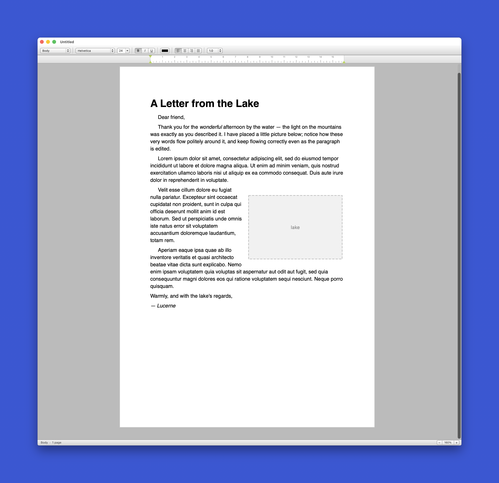

# Lucerne

*An experimental word processor with only the features I actually need and a classic user interface inspired by ClarisWorks — a small, pleasant tool for writing
letters, with rulers, tabs, and free placement of images.*



**Latest release:** v<!-- version -->0.6.0<!-- /version --> · [Download](https://github.com/L-K-M/Lucerne/releases/latest)

> [!IMPORTANT]
> LLM Disclosure: Much of this code base was written by or with the help of large language models. AI coding agents worked from the [`AGENTS.md`](AGENTS.md) brief in this repo.


## Documents: the `.luce` file

Lucerne saves `.luce` files. A `.luce` file **is a ZIP archive** (it conforms to
`public.zip-archive`), so the recovery story is literally "rename it to `.zip` and
unzip." Inside:

```
document.json   canonical, lossless model — text runs + placed objects (the source of truth)
images/         the placed images as their original files
content.md      a derived, human-readable Markdown copy of the text (write-only escape hatch)
history/        optional dated Markdown backups, thinned with age, for recovery
```

`content.md` is **regenerated on every save and never read back** — it exists so a
future human can recover the words and pictures even if this app is gone. A short
overview is in [`docs/file-format.md`](docs/file-format.md); the complete,
normative specification — enough to build a compatible tool, with a JSON Schema —
is in [`docs/luce-format-spec.md`](docs/luce-format-spec.md).

## Building & running

> **Requires macOS** (Ventura 13+) and the Swift toolchain (Xcode 15+ or the
> Swift.org toolchain). This repository was authored on Linux, where AppKit is
> unavailable, so it **cannot be compiled in that environment** — build it on a
> Mac. Compilation is verified by the macOS GitHub Actions workflow.

Quick development run (no app bundle, panels-based open/save work):

```sh
swift run Lucerne
```

Produce a double-clickable `Lucerne.app` (with `.luce` document-type registration):

```sh
Scripts/build.sh           # writes dist/Lucerne.app and reveals it in Finder
Scripts/build.sh --run     # …and launches it
```

`Scripts/build.sh` is the recommended local build: an incremental release build by
default, wrapping `Scripts/make-app.sh` (the bundle assembler), then revealing the
result in Finder. Use `--clean` to rebuild from scratch (wipes `.build/` and `dist/`).

Run the tests (model, Markdown export, geometry — no GUI needed):

```sh
swift test
```

See [`docs/building.md`](docs/building.md) for details and troubleshooting.